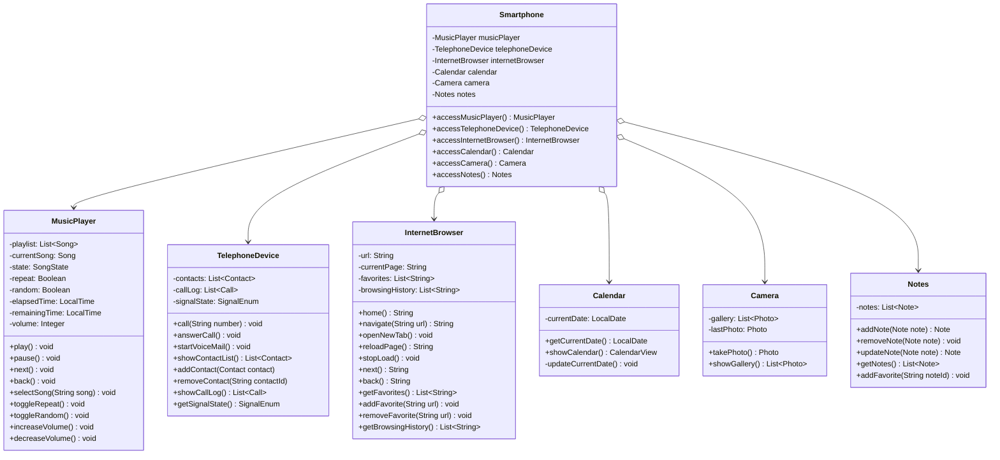

# Desafio de projeto DIO

Neste desafio, foi modelado e diagramado a representação UML do componente Smartphone, abrangendo suas funcionalidades como Reprodutor Musical, Aparelho Telefônico e Navegador na Internet.

## UML

